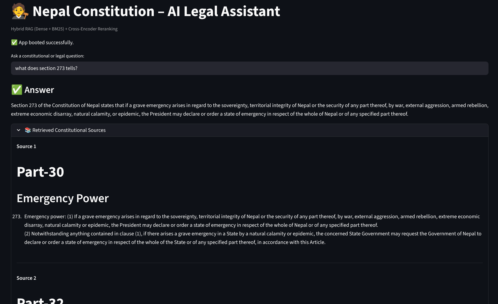
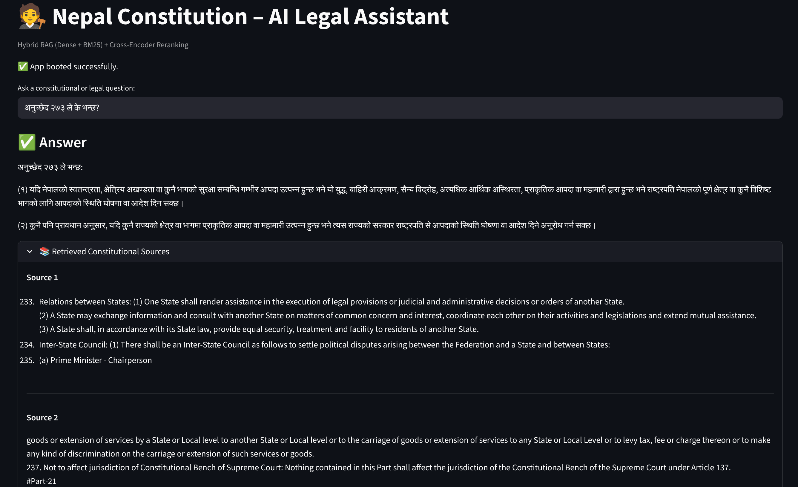

# Nepal Constitution AI – Hybrid RAG Legal Assistant
## 🟢 Project is live on https://botinfinity-nepal-constitution-assistant-ai.hf.space/

Nepal Constitution AI is an AI-powered legal assistant that answers questions about the Constitution of Nepal using a Retrieval-Augmented Generation (RAG) pipeline.

It combines:

- Hybrid retrieval over a local Qdrant vector store (dense + BM25 sparse)
- Multilingual embeddings (BAAI/bge-m3) so you can query in English or Nepali
- A cross-encoder reranker for high-precision results
- A fast Groq LLM (LLaMA 3.1) for grounded answer generation
- A Streamlit UI for interactive exploration

> ⚖️ This project is for educational and informational purposes only and does not constitute legal advice.

---

## Features

- Hybrid RAG (Dense + Sparse)
	- Uses `QdrantVectorStore` with `RetrievalMode.HYBRID` to combine dense embeddings (`BAAI/bge-m3`) and sparse BM25-style embeddings (`Qdrant/bm25` via `FastEmbedSparse`).
- Cross-Encoder Reranking
	- Retrieved chunks are reranked with `cross-encoder/ms-marco-MiniLM-L-6-v2` to prioritize the most relevant passages.
- Groq LLM Integration
	- Uses `ChatGroq` with the `llama-3.1-8b-instant` model for fast, instruction-following responses.
- Multilingual Embeddings
	- `BAAI/bge-m3` supports multiple languages (including Nepali), enabling English, Nepali, or mixed-language queries.
- PDF → Markdown via Docling
	- The Constitution PDF is parsed with Docling and converted into a clean Markdown file used as the knowledge base.
- Local, Embedded Qdrant DB
	- Uses a file-based Qdrant instance (`qdrant_client(path="./qdrant_db")`), so no external Qdrant server is required.
- Streamlit UI
	- Simple web app interface to ask legal/constitutional questions, view AI answers, and inspect retrieved sources.

---

## Demo

Sample screenshots from the app are included in the `sample/` folder:

- `sample/demo_output_english_query.png` – Example English query and response
- `sample/demo_output_nepali_query.png` – Example Nepali query and response





---

## Architecture Overview

1. **Document Ingestion (Offline / Preprocessing)**
	 - `data/parse_pdf.py` uses Docling to convert the Nepal Constitution PDF to Markdown.
	 - The resulting Markdown is stored as `data/converted_law.md`.

2. **Chunking & Indexing (First App Run)**
	 - `data/chunks.py` loads the Markdown and:
		 - Splits by Markdown headers using `MarkdownHeaderTextSplitter`.
		 - Further splits into overlapping chunks using `RecursiveCharacterTextSplitter`.
	 - `app.py`:
		 - Embeds chunks with `HuggingFaceEmbeddings("BAAI/bge-m3")`.
		 - Creates a hybrid Qdrant index (`QdrantVectorStore`) with both dense and BM25 sparse embeddings.
		 - Persists everything to `./qdrant_db/nepal_law`.

3. **Query Flow (At Runtime)**
	 - User enters a question in the Streamlit app.
	 - The app:
		 - Retrieves top-k chunks via hybrid search from Qdrant.
		 - Reranks results with a CrossEncoder (`ms-marco-MiniLM-L-6-v2`).
		 - Constructs a strict, context-grounded prompt.
		 - Calls Groq's LLM (`llama-3.1-8b-instant`) with low temperature for factual answers.
	 - The answer and supporting constitutional text chunks are displayed in the UI.

---

## Project Structure

```bash
NEPAL_Constitution_Assistant_AI/
├─ app.py                  # Streamlit app: RAG pipeline and UI
├─ Dockerfile              # Containerization for deployment
├─ README.md               # Project documentation
├─ requirements.txt        # Python dependencies
├─ .env                    # Environment variables (GROQ_API_KEY)
├─ data/
│  ├─ chunks.py            # Markdown chunking and text splitting
│  ├─ parse_pdf.py         # Docling-based PDF → Markdown converter
│  └─ converted_law.md     # Preprocessed Nepal Constitution in Markdown
├─ qdrant_db/              # Local Qdrant embedded database (auto-created)
│  ├─ meta.json
│  └─ collection/nepal_law/
├─ sample/                 # Demo output screenshots
│  ├─ demo_output_english_query.png
│  └─ demo_output_nepali_query.png
└─ colab_notebook/
	 └─ ConstitutionAI.ipynb # Experimentation / prototyping notebook
```

---

## Prerequisites

- Python 3.10+
- pip (latest recommended)
- Groq API key:
	- Sign up at https://console.groq.com
	- Create an API key

Optional (for Docker):

- Docker 20+ recommended

---

## Setup (Local Development)

### 1. Clone the Repository

```bash
git clone https://github.com/GaneshNeupane01/RAG_Based_Constitution_Assistant_AI_NEPAL.git
cd RAG_Based_Constitution_Assistant_AI_NEPAL
```

### 2. Create and Activate a Virtual Environment (Recommended)

```bash
python -m venv .venv
source .venv/bin/activate   # Linux / macOS
# .venv\Scripts\activate    # Windows (PowerShell)
```

### 3. Install Dependencies

```bash
pip install --upgrade pip
pip install -r requirements.txt
```

### 4. Configure Environment Variables

A `.env` file is already used by the app (via `python-dotenv`).

Create or edit `.env` in the project root:

```env
GROQ_API_KEY=YOUR_REAL_GROQ_API_KEY_HERE
```

> Make sure you do not commit your real API key to Git.

---

## Data Preparation (Constitution PDF → Markdown)

The repository already expects a processed Markdown file at:

- `data/converted_law.md`

If you want to regenerate this from the original PDF (e.g., updated constitution or a different language version), you can:

1. Place your Constitution PDF (e.g., `Constitution.pdf`) in the project root.
2. Run the Docling converter:

	 ```bash
	 python data/parse_pdf.py
	 ```

3. This will export a `converted_law.md`. Move or copy it into `data/` if needed:

	 ```bash
	 mv converted_law.md data/converted_law.md
	 ```

You can also adjust paths inside `data/parse_pdf.py` to fit your own directory layout.

---

## Running the App

Once dependencies and `.env` are set up:

```bash
streamlit run app.py
```

By default, Streamlit runs at:

- URL: `http://localhost:8501`

### First Run: Building the Vector DB

On the first launch, if `./qdrant_db` does not exist:

- The app will:
	- Load `data/converted_law.md`.
	- Chunk the text into overlapping segments.
	- Build a Qdrant hybrid index with dense + sparse embeddings.
- You will see a message like:

> "📚 Building vector DB... this may take a while"

When it completes, you will see:

> "✅ Vector DB built successfully. Please rerun the app."

Stop the app and run `streamlit run app.py` again. Subsequent runs will reuse the existing Qdrant DB.

---

## Using the App

1. Open the URL (typically `http://localhost:8501`).
2. Enter your question in the prompt box, for example:
	 - "What does Article 275 say about local governance?"
	 - "नेपालको संविधान अनुसार मौलिक अधिकारहरू के के हुन्?"
3. The app will:
	 - Retrieve and rerank relevant constitutional passages.
	 - Generate a grounded answer using the Groq LLM.
4. You will see:
	 - An **Answer** section with a formal, neutral explanation.
	 - **Retrieved Constitutional Sources** (expandable) showing the text chunks used as context.

The system is instructed to:

- Use only the provided context.
- Not invent articles or clauses.
- Explicitly say when it cannot find an answer in the context.

---

## RAG & Retrieval Details

Key implementation points (see `app.py` and `data/chunks.py`):

- **Embeddings**
	- `HuggingFaceEmbeddings` with `model_name="BAAI/bge-m3"`.
	- `encode_kwargs={"normalize_embeddings": True}` for cosine similarity.
- **Sparse (BM25) Retrieval**
	- `FastEmbedSparse(model_name="Qdrant/bm25")`.
- **Vector Store**
	- `QdrantClient(path="./qdrant_db")` – local embedded Qdrant.
	- `QdrantVectorStore(..., retrieval_mode=RetrievalMode.HYBRID)`.
- **Reranking**
	- `CrossEncoder("cross-encoder/ms-marco-MiniLM-L-6-v2")`.
	- Top results are reranked before being passed as context to the LLM.
- **LLM**
	- `ChatGroq(model="llama-3.1-8b-instant", temperature=0.2, max_tokens=600)`.

---

## Multilingual Support

- **Embeddings**: `BAAI/bge-m3` is a multilingual model, so:
	- Queries in Nepali can still retrieve the correct constitutional context.
	- Queries can be in English, Nepali, or a mix of both.

- **LLM responses**:
	- By default, the prompt asks for formal, neutral legal language (typically English).
	- You can explicitly request answers in Nepali in your question (e.g., "Please answer in Nepali").

---

## Running with Docker

A simple Dockerfile is included for containerized deployment.

### 1. Build the Image

```bash
docker build -t nepal-constitution-ai .
```

### 2. Run the Container

```bash
docker run \
	-e GROQ_API_KEY=YOUR_REAL_GROQ_API_KEY_HERE \
	-p 8501:8501 \
	nepal-constitution-ai
```

Then open:

- `http://localhost:8501`

If you want persistent storage for the Qdrant DB outside the container, you can mount a volume:

```bash
docker run \
	-e GROQ_API_KEY=YOUR_REAL_GROQ_API_KEY_HERE \
	-p 8501:8501 \
	-v $(pwd)/qdrant_db:/app/qdrant_db \
	nepal-constitution-ai
```

---

## Limitations & Disclaimer

- The system is limited to the content of the processed constitution Markdown (`data/converted_law.md`).
- It does not cover case law, regulations, or other legal sources unless you extend it.
- While it strives for accuracy, AI-generated outputs may be incomplete or imprecise.

> Always consult a qualified legal professional before relying on any answer from this system.

---

## Extending the Project

Some ideas for future enhancements:

- Add more legal documents (acts, regulations) and store them in separate collections.
- Allow selection of language for output (English / Nepali toggle).
- Add support for more granular metadata (articles, parts, clauses, dates).
- Integrate authentication and usage analytics for production deployments.

---

## Contributing

Contributions, suggestions, and bug reports are welcome.

1. Fork the repo.
2. Create a new branch (`feature/my-improvement`).
3. Commit your changes.
4. Open a Pull Request with a clear description and rationale.

---

## 👤 Author
**Ganesh Neupane**
Computer Engineering | AI / ML
- GitHub: [@GaneshNeupane01](https://github.com/GaneshNeupane01)
- Detail: [@portfolio](https://ganesh-neupane.com.np)
